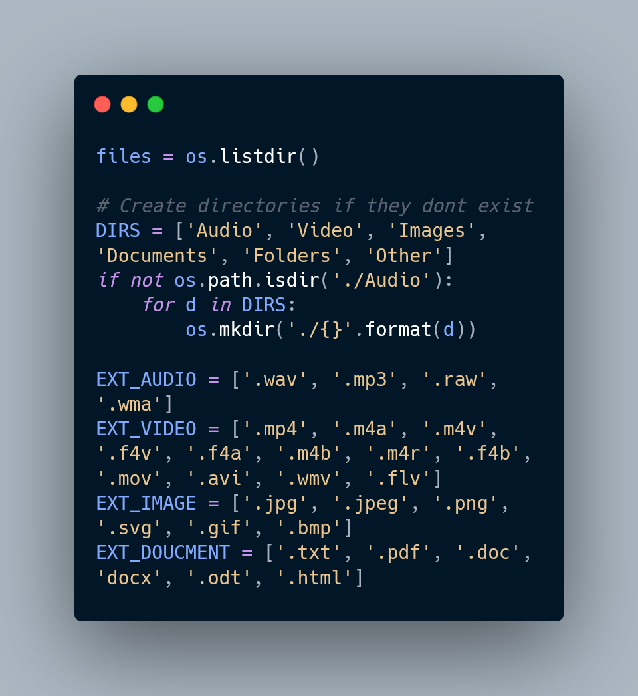

# Python Script

[](https://www.python.org/downloads/release/python-390/)

## Description
This Python script automates messed-up folders by formatting and gathering files with similar formats in a new folder.

## Installation
1. Make sure you have Python 3.0 installed. You can download it from [here](https://www.python.org/downloads/release/python-390/).
2. Clone this repository:

   ```shell
   git clone https://github.com/AlirezaRafiyian/Automation.git

I. Navigate to the project directory:
  cd your-repository
  
## Attention
Some classes may have changed due to the newer version.
